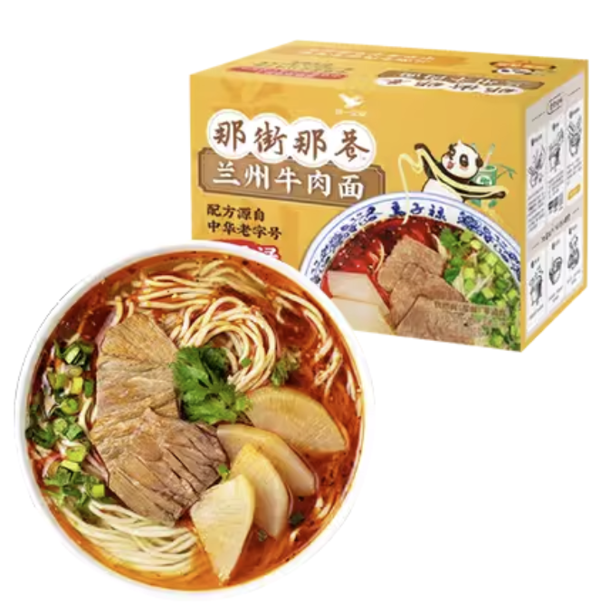
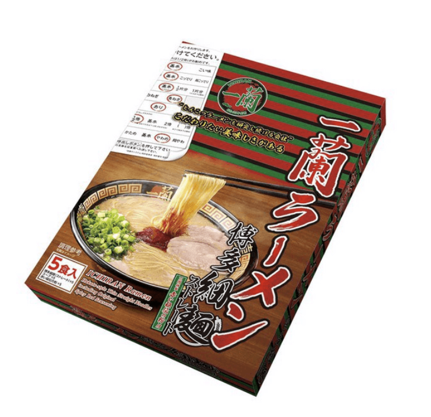
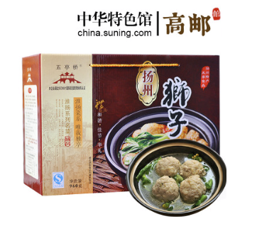
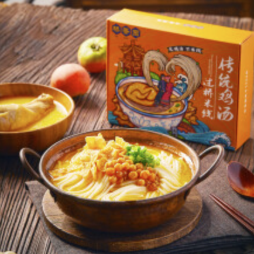

# 海运食品和预制菜

作为海外的华人，吃永远是个绕不过的问题。这个项目希望大家一起总结适合海运的食品。目前为止，我发现了不少不错的食物，有些甚至可以达到国内饭店的水品。
推荐食品的格式如下

### 食品名

常温保质期

生产厂家

## 预制菜
### 统一那街那巷兰州牛肉面拉面

常温保质期：150天

生产厂家：统一

### 一兰拉面

常温保质期：365天

生产厂家：ICHIRAN/一兰

### 五亭桥扬州狮子头

常温保质期：150天

生产厂家：五亭桥

### 桥香园过桥米线

常温保质期：180天

生产厂家：桥香园